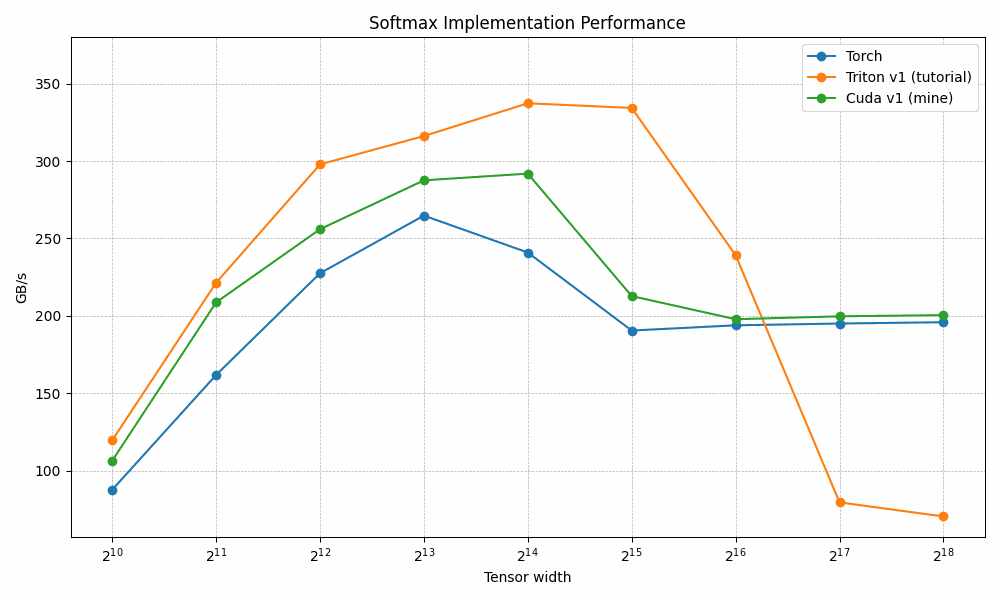

# softmax-kernels
GPU kernel optimization: Softmax



## Usage

> The following code was tested using the docker image: `nvidia/cuda:12.4.0-devel-ubuntu22.04` on a Geforce RTX 2070

* Build Python library with CUDA bindings

```bash
cd cuda
pip install .
```

* Test both implementations against Pytorch baseline

```bash
python3 assertions.py
```

* Run a benchmark

```bash
python3 benchmark.py
```

* Profile both implementations

```bash
ncu --set full [-o output_path] python3 -O assertions.py
```

## Articles

* [Part 1: First CUDA implementation](https://medium.com/@hugo.rosenkranz/gpu-kernel-optimization-softmax-part-1-8ff80766cc95)

* Part 2: Beating Triton: WIP

* Part 3: Online Softmax: WIP

